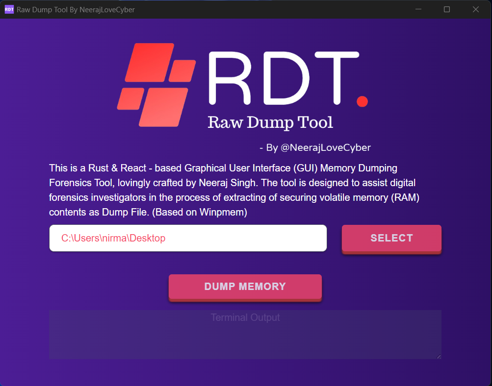

#  Raw Dump Tool V2 (Memory Dumping Tool) 

This is a Rust & React - based Graphical User Interface (GUI) Memory Dumping Forensics Tool, lovingly crafted by Neeraj Singh. The tool is designed to assist digital forensics investigators in the process of extracting of securing volatile memory (RAM) contents as Dump File With a simple user Friendly Gui. (It is Based on Winpmem https://github.com/Velocidex/WinPmem , So a Big Shoutout to Them)

## Preview 

 

## How to Use

    (Instructions on how to download/install the tool)

1. Download the Exe file from here [Releases](https://github.com/neerajlovecyber/Raw-Dump-Tool-V2/releases)
2. Install the application and Run as Administrator.
3. Choose a Location to Dump Files.
4. Initiate the memory dumping process (Don't Close the winpmem popup it will close automatically once Dumping is Completed) .

The tool will analyze the memory contents and generate the dump file.

## Contributing

If you find this tool helpful and wish to contribute, feel free to submit bug reports, feature requests, or even pull requests. Your contributions are highly appreciated.

## License

This project is licensed under the MIT License. You are encouraged to modify and distribute the tool in compliance with the license terms.

## Contact

If you have any questions, suggestions, or just want to say hi, you can reach out to Neeraj Singh at neerajlovecyber@gmail.com or connect on [LinkedIn](https://www.linkedin.com/in/neerajlovecyber/).

Happy Memory Dumping and Forensics Investigation!
